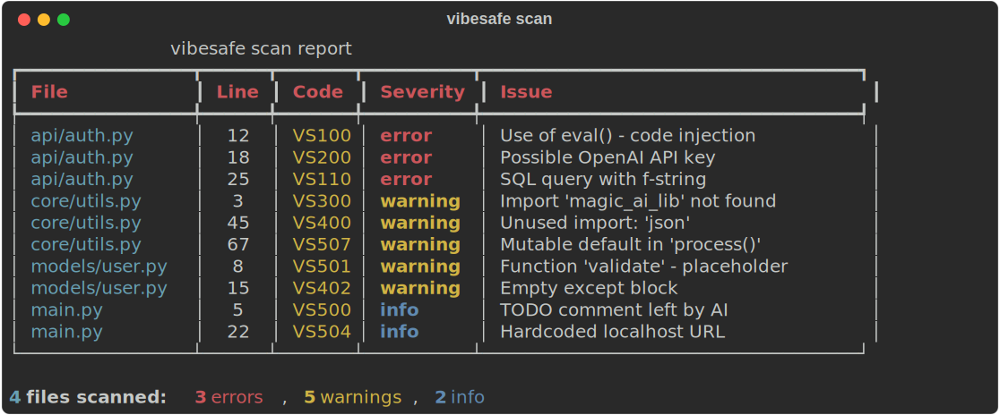
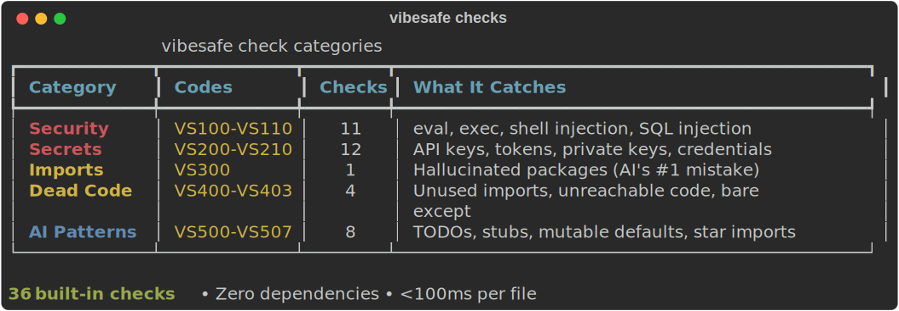

# vibesafe

[](https://github.com/stef41/vibesafe/actions/workflows/ci.yml)
[](https://www.python.org/downloads/)
[](LICENSE)
[](https://pypi.org/project/vibesafe/)

**Stop shipping AI-generated code you haven't reviewed.**

vibesafe catches the bugs your AI coding agent won't tell you about: hallucinated imports, hardcoded secrets, security vulnerabilities, and dead code.

Built for the vibe coding era. Works with code from Claude Code, Cursor, Copilot, Windsurf, and any AI coding tool.

## Quick Start

```bash
pip install vibesafe
vibesafe scan .
```

## What It Catches

| Code | Category | Severity | What |
|------|----------|----------|------|
| VS100-VS110 | **Security** | error | `eval()`, `exec()`, `shell=True`, SQL injection, `os.system()`, unsafe YAML, weak hashes |
| VS200-VS210 | **Secrets** | error | OpenAI/AWS/GitHub/Anthropic/Stripe API keys, private keys, JWTs, hardcoded credentials |
| VS300 | **Imports** | warning | Hallucinated imports — packages that don't exist (AI's favorite mistake) |
| VS400-VS403 | **Dead Code** | warning | Unused imports, unreachable code, empty `except: pass`, bare except |
| VS500-VS507 | **AI Patterns** | warning | TODO/FIXME left by AI, placeholder functions, `NotImplementedError` stubs, mutable defaults, star imports |

## Usage

### Scan a directory
```bash
vibesafe scan src/
```

### Scan specific files
```bash
vibesafe scan main.py utils.py
```

### Check code from stdin
```bash
echo 'x = eval(input())' | vibesafe check
```

### JSON output (for CI/CD)
```bash
vibesafe scan . --format json
```

### Filter by severity
```bash
vibesafe scan . --severity error          # Only errors
vibesafe scan . --fail-on warning         # Fail CI on warnings too
```

## Python API

```python
from vibesafe import scan_code, scan_file, scan_directory

# Scan a string
issues = scan_code('x = eval(input())')
for issue in issues:
    print(f"{issue.code}: {issue.message}")

# Scan a file
issues = scan_file("main.py")

# Scan a project
result = scan_directory("src/")
print(f"{result.error_count} errors found in {result.files_scanned} files")
```

### Custom scanner configuration

```python
from vibesafe import Scanner

scanner = Scanner(
    severity_threshold="warning",  # Skip info-level
    exclude_dirs={".venv", "migrations"},
)
result = scanner.scan_directory(".")
```

## Example Output




```
  ✗ main.py:5:0 [error] VS100: Use of eval() - potential code injection vulnerability
  ✗ main.py:8:0 [error] VS200: Possible OpenAI API key
  ⚠ main.py:12:0 [warning] VS300: Import 'magic_ai_lib' - package 'magic_ai_lib' not found (hallucinated import?)
  ⚠ main.py:15:0 [warning] VS501: Function 'process' has empty body (pass) - placeholder
  ℹ main.py:20:0 [info] VS500: TODO comment - AI may have left incomplete implementation

5 files scanned: 2 errors, 2 warnings, 1 info
```

## Pre-commit Hook

```yaml
# .pre-commit-config.yaml
repos:
  - repo: local
    hooks:
      - id: vibesafe
        name: vibesafe
        entry: vibesafe scan --fail-on error
        language: python
        types: [python]
        additional_dependencies: [vibesafe]
```

## Why Not Just Use Ruff/Pylint?

vibesafe focuses specifically on **AI-generated code patterns** that traditional linters miss:

- **Hallucinated imports**: AI confidently imports packages that don't exist. vibesafe checks against stdlib, installed packages, and 200+ known popular packages.
- **Secret leakage**: AI copies real-looking API keys into code. vibesafe detects patterns for 12+ providers.
- **Placeholder code**: AI leaves `pass`, `...`, `NotImplementedError` stubs that slip through review.
- **AI anti-patterns**: Mutable defaults, star imports, excessive `Any` — patterns AI generates more often than humans.

Use vibesafe **alongside** your existing linter, not instead of it.

## License

Apache 2.0
